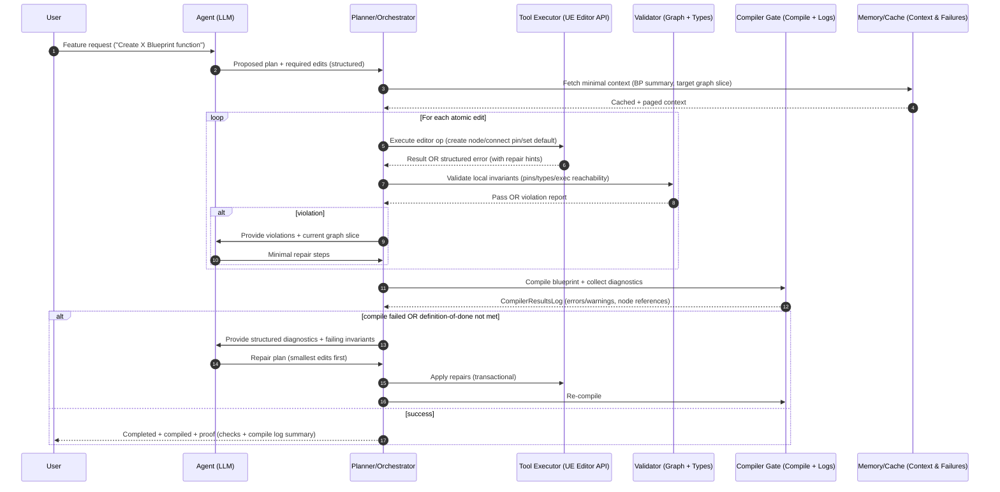
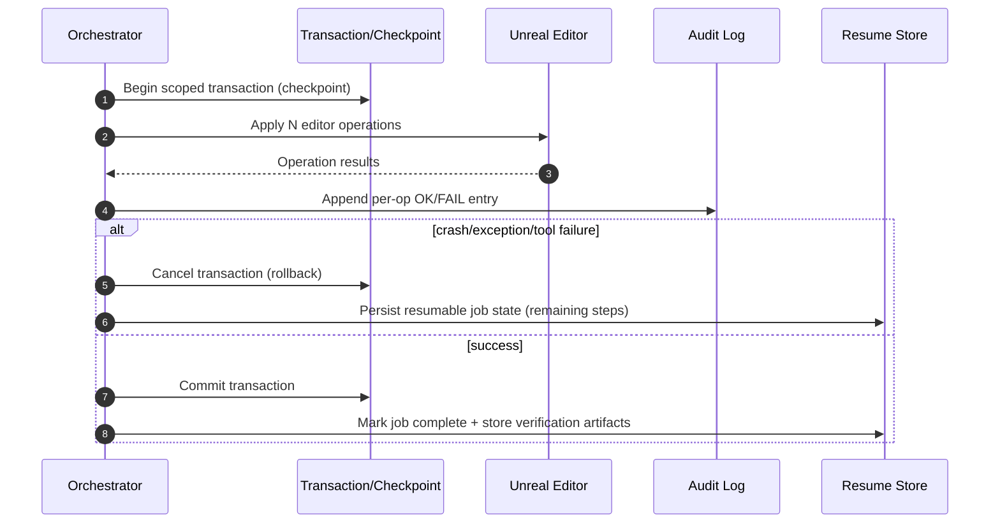

# Building a Reliable LLM-to-Blueprint Generator for Unreal Engine

## Executive summary

You are already “beyond phase 0–1” (basic editor integration exists), so the remaining reliability gap—**complete, compilable Blueprint functions rather than empty/incomplete stubs**—is usually caused by missing **hard verification gates** and **self-repair scaffolding**, not “prompt quality.” The most reliable Aura/NeoStack-style systems behave less like “Blueprint generators” and more like **transactional build systems**: they decompose work into small editor operations, apply operations under undo/rollback, compile immediately, parse structured diagnostics, and iterate until a strict definition-of-done is satisfied. citeturn14view2turn15view3turn8view2turn7view3turn2search0turn2search2turn3search7

Publicly observable NeoStack behavior and documentation emphasize exactly these stability levers: **tool-call visibility + permission requests**, **context attachments**, **profiles that whitelist tools**, **audit logging**, **session resumption**, tool consolidation to reduce misfires, and post-edit “Blueprint health” validation with crash-protected rollback. citeturn7view1turn11view1turn11view2turn7view2turn7view3turn11view3

On the Unreal Engine side, building this reliably is feasible because the editor exposes the primitives you need: create and attach function graphs (via `FBlueprintEditorUtils`), mark structural vs. non-structural changes, compile programmatically (via `FKismetEditorUtilities` and/or `FBlueprintCompilationManager`), obtain rich compiler diagnostics (`FCompilerResultsLog`), connect pins through schema-validated APIs (`UEdGraphSchema::TryCreateConnection`, `UEdGraphSchema_K2::ArePinsCompatible`), and wrap everything in transactions (`FScopedTransaction`) that can be canceled. citeturn8view1turn14view1turn13search1turn14view2turn8view3turn4search2turn15view1turn14view4turn8view2

A rigorous architecture therefore centers on seven pillars (mirroring your requested attributes): (a) granular tools, (b) plan–execute–check–fix loops, (c) transaction/checkpointing, (d) compile+verification gates, (e) node catalog + pin/type rules, (f) context pagination/caching with structured errors, and (g) job resumption plus metrics/audit logs. citeturn7view3turn14view0turn15view1turn2search0turn2search1turn2search2turn3search7turn3search11

## What Aura and NeoStack reveal about reliability patterns

**Aura: public signals and constraints**  
Aura is presented as an Unreal-focused agent with Blueprint generation and “deep project understanding,” but public, machine-readable documentation pages appear to load content client-side (the web snapshot surfaces navigation + “Loading…” rather than actual instructions). This limits how much can be rigorously extracted from official Aura docs in this report; the most citable primary source is therefore Aura’s public site + forum announcement. citeturn5view1turn10view0turn19view0

From the Epic forums announcement, the creators emphasize stability and phased rollout; community feedback also surfaces common failure modes for early agentic Blueprint tooling (e.g., refusal to edit existing Blueprints, settings not sticking), which are precisely the issues robust “definition-of-done + verification” architectures mitigate. citeturn19view0

**NeoStack: explicit mechanics that map to engineering levers**  
NeoStack’s documentation is unusually concrete about mechanisms that directly influence “empty/incomplete function” outcomes:
- The agent executes tool calls inside the editor, shows tool calls, and requests permission for destructive operations—pushing the system toward smaller, auditable steps. citeturn7view1turn11view1  
- Users can attach targeted context via `@` mentions and right-click attachments on Blueprint nodes, improving locality and reducing context thrash. citeturn11view1  
- Profiles strictly whitelist tools and append custom instructions, reducing tool confusion and encouraging specialized behaviors per workflow. citeturn11view2  
- There is a first-class “audit log” (`Saved/Logs/AIK_ToolAudit.log`) and guidance to use it to reproduce failures; the format includes per-operation OK/FAIL entries. citeturn7view2  
- Changelog entries describe stability strategies: crash-protected tool execution with clean rollback, post-edit Blueprint health validation, session resume, and consolidating many tools into fewer “smarter” tools to reduce wrong-tool selection. citeturn7view3  

These are not “prompt tricks”; they are system design choices that enforce correctness by constraining actions and continuously verifying state.

**Academic and empirical evidence for looped generation**  
The research literature supports iterative “act → observe feedback → refine” loops over one-shot generation:
- ReAct formalizes interleaving reasoning and acting against an environment, reducing hallucination by grounding decisions in tool feedback. citeturn2search0turn2search12  
- Self-Refine shows iterative feedback→refinement can improve outputs without extra training, a pattern closely analogous to compile-error-driven repairs. citeturn2search2turn2search31  
- Reflexion adds “episodic memory” style reflection from prior failures to improve subsequent attempts—directly relevant to recurring Blueprint graph mistakes (wrong pin names, missing exec wires). citeturn2search1turn2search37  
- Empirical studies of LLM code generation identify incomplete code and undefined references as common causes of compilation errors, and show that iterative sampling/repair is a practical mitigation. citeturn3search0turn3search11  
- Tooling systems such as LLMLOOP explicitly implement iterative loops for compilation errors and other checks, demonstrating the general effectiveness of “feedback loops as infrastructure.” citeturn3search7  
- SWE-bench highlights that real-world engineering tasks require environment interaction and long-context handling, reinforcing the need for stateful tool use + selective context retrieval rather than monolithic prompting. citeturn3search2turn3search22  

## Recommended architecture for reliable Blueprint function generation

The architecture below is intentionally “compiler-like”: the LLM proposes *edits*; the system executes them as transactions; a verifier/validator layer checks invariants; compilation provides authoritative feedback; and the system repeats until a strict definition-of-done is met. Unreal Engine’s Blueprint compilation model and APIs align well with this approach: compilation transforms graphs into classes/functions and emits structured diagnostics via compiler logs. citeturn8view0turn4search2

image_group{"layout":"carousel","aspect_ratio":"16:9","query":["Unreal Engine Blueprint Editor graph screenshot","Unreal Engine Blueprint pins connection tooltip incompatible pins","Unreal Engine Blueprint compile errors message log screenshot"],"num_per_query":1}


This sequence is grounded in Unreal Engine’s compilation/diagnostic pipeline (Blueprint compilation produces structured compiler output) and transaction support, and reflects established agentic “act + feedback” research patterns. citeturn8view0turn4search2turn8view2turn2search0turn2search2turn3search7


This matches publicly described NeoStack behavior (audit logging, crash-protected rollback, resuming sessions/workflows) and uses Unreal’s scoped transaction concept. citeturn7view2turn7view3turn8view2

## Tool API and error schema design

A key distinction between “often empty functions” and “reliably complete functions” is whether your tools are **atomic and verifiable**. Unreal already models graph editing as a sequence of small actions: create graphs, add nodes, connect pins, and sometimes insert conversion nodes when types differ. citeturn8view1turn14view0turn15view1turn14view3turn15view0

The table below proposes a concrete, minimal-but-sufficient tool surface. It is designed so every call (a) can be validated immediately and (b) can return structured repair hints using Unreal schema rules (compatibility checks, connection responses, conversion node creation). citeturn15view1turn14view4turn14view3turn15view0

| Tool | Purpose (granularity) | Core args (examples) | Returns (success) | Structured error codes (examples) | Repair hints (examples) |
|---|---|---|---|---|---|
| `bp.open(asset_path)` | Load Blueprint asset + resolve stable IDs | `"/Game/BP_Player"` | `bp_id`, `class`, `graphs[]` | `ASSET_NOT_FOUND`, `NOT_BLUEPRINT` | Suggest nearest asset names from registry (optional) |
| `bp.read_summary(bp_id)` | Context pagination: list vars, funcs, components, graphs | `bp_id` | `vars[]`, `functions[]`, `graphs_meta[]` | `BP_UNLOADED` | Include list of valid function names when mismatch occurs |
| `bp.create_function(bp_id, name, signature)` | Create function graph (stub only) | name, inputs/outputs, `is_pure` | `function_graph_id` | `NAME_INVALID`, `NAME_CONFLICT` | Suggest safe name (Unreal sanitization) |
| `bp.add_node(graph_id, node_kind, node_spec)` | Add a single node (by class or by callable function) | `UK2Node_CallFunction` + function ref | `node_id`, `pin_ids[]` | `NODE_KIND_UNSUPPORTED`, `FUNCTION_NOT_FOUND` | Suggest valid callable overloads; return function signature |
| `bp.list_pins(node_id)` | Node introspection after spawn | `node_id` | `pins[]` (direction/type/name/default) | `NODE_NOT_FOUND` | Return closest pin names (“Did you mean…”) |
| `bp.connect(pin_a, pin_b, mode)` | Connect pins using schema rules | `pin_a`, `pin_b`, `mode="try_autoconvert"` | `connected=true`, maybe `conversion_node_id` | `PINS_INCOMPATIBLE`, `PIN_DIRECTION_INVALID` | Include `schema_reason`, `can_autoconvert`, suggest conversion |
| `bp.set_pin_default(pin_id, value)` | Set literal defaults (when valid) | `pin_id`, serialized value | `ok` | `DEFAULT_INVALID` | Return schema validation message / expected format |
| `bp.set_node_property(node_id, prop, value)` | Set node properties (e.g., function target) | `prop="FunctionReference"` | `ok` | `PROPERTY_NOT_FOUND`, `VALUE_INVALID` | Return allowed enum values/options |
| `bp.remove(node_id/pin_link/etc.)` | Delete node or break link | target id | `ok` | `TARGET_LOCKED`, `BREAKLINK_INCONSISTENT` | Provide safe alternative path (use schema break API) |
| `bp.mark_modified(bp_id, structural)` | Distinguish structural vs. non-structural edits | `structural=true/false` | `ok` | `BP_UNLOADED` | If unsure, default to structural when graph/function list changed |
| `bp.compile(bp_id, mode)` | Compile + capture diagnostics | `mode="sync"` | `status`, `errors[]`, `warnings[]`, `log_tokens[]` | `COMPILE_FAILED`, `COMPILE_TIMEOUT` | Return node references / pin refs when possible |
| `bp.verify(bp_id, function_graph_id, checks[])` | Definition-of-done gate | check list | `pass/fail`, `violations[]` | `VERIFY_INTERNAL_ERROR` | Suggest minimal fix order (e.g., exec reachability first) |
| `job.save_state(job_id, state)` | Resume mechanism | graph+todo+cursor | `ok` | `STATE_TOO_LARGE` | Store only deltas + stable IDs |
| `audit.append(entry)` | Append tool audit row | op, args hash, result | `ok` | `AUDIT_IO_FAIL` | Fall back to in-memory buffer |

**Why Unreal-specific connect semantics matter**  
Your connect tool should not “blindly link” pins; it should use schema compatibility rules, because Unreal explicitly models “compatible pins,” incompatibility reasons, and automatic conversion node insertion. citeturn14view0turn14view4turn14view3turn15view1turn15view0

Concretely, Unreal exposes:
- Pin-level linking primitives (`UEdGraphPin::MakeLinkTo`, `BreakLinkTo`, etc.). citeturn15view0  
- Schema-level connection attempts (`UEdGraphSchema::TryCreateConnection`) and conversion-node helpers (`UEdGraphSchema::CreateAutomaticConversionNodeAndConnections`). citeturn15view1turn14view3  
- Blueprint schema compatibility checks (`UEdGraphSchema_K2::ArePinsCompatible`). citeturn14view4  

If your plugin’s connect operation does not surface **a machine-readable incompatibility reason** (analogous to the editor’s tooltip reason), the LLM cannot reliably repair mis-connections. citeturn14view0

## Validation gates, node catalog, and pin/type rules

Reliable Blueprint generation requires two layers of correctness:

**Layer one: local structural/type correctness (pre-compile)**  
This layer catches “empty function” patterns early: missing exec chains, orphan outputs, invalid defaults, mismatched pin types, etc. It should run after *each* micro-edit and again at the end. The Unreal schema and node APIs support introspection and schema validation (pins, defaults, node validation hooks). citeturn15view1turn14view4turn18view2turn15view0

**Layer two: compiler truth (compile gate)**  
Compilation is the authoritative check: Blueprint compilation converts graphs into classes/functions and emits detailed diagnostics; Unreal exposes both compilation entrypoints and compiler log structures. citeturn8view0turn14view2turn8view3turn4search2

A practical implementation uses:
- `FKismetEditorUtilities::CompileBlueprint` (compile and update editor instances). citeturn14view2  
- Or direct synchronous compilation via `FBlueprintCompilationManager::CompileSynchronously` when you need immediacy. citeturn8view3turn8view0  
- A `FCompilerResultsLog` to capture rich, tokenized errors/warnings. citeturn4search2turn14view2  
- Post-edit dirtying/structural marking via `FBlueprintEditorUtils::MarkBlueprintAsModified` vs. `MarkBlueprintAsStructurallyModified`. citeturn13search1turn14view1turn13search7  

**Suggested verification rules (definition-of-done oriented)**  
The table below gives concrete, implementation-friendly checks that target “empty/incomplete functions” specifically.

| Check category | Rule (what to validate) | Why it prevents incomplete functions | How to implement in UE terms |
|---|---|---|---|
| Exec reachability | For non-pure functions, there must be an exec path from Entry to at least one meaningful node and to Return (or a terminal) | “Empty” functions often have Entry/Return only, or disconnected exec chain | Walk exec pins from Entry node; verify Return reachable; use node pin lists + schema directions (inference grounded in exec pin model) citeturn14view0turn18view1 |
| Required pin satisfaction | Any required input pins must be connected or have valid defaults | Prevents partially wired graphs that compile-fail or runtime-fail | Use `UEdGraphSchema::IsPinDefaultValid` / schema checks where available, and validate “linked or defaulted” citeturn15view1turn14view0 |
| Type compatibility | Only connect schema-compatible pins; if not compatible but auto-convert possible, insert conversion node | Prevents silent mis-wires and “function left incomplete because connect failed” | Use `UEdGraphSchema_K2::ArePinsCompatible`, then `TryCreateConnection`, else `CreateAutomaticConversionNodeAndConnections` when `bCanAutoConvert` citeturn14view4turn15view1turn14view3turn14view0 |
| No orphan critical nodes | Node types that produce required outputs (e.g., CallFunction return value used later) must have consumers or explicit ignore handling | Avoids graphs that “look built” but don’t actually use generated values | Dataflow walk from critical sources; flag dead outputs (inference; see compiler pruning behavior) citeturn8view0 |
| Graph integrity | No broken reciprocal links; no invalid pin references; no nodes missing AllocateDefaultPins results | Prevents latent corruption leading to later failures | Prefer schema-level link ops; avoid manual unbalanced break links; verify pin linked symmetry (pin API + forum failure examples) citeturn15view0turn1search2turn15view1 |
| Post-edit structural correctness | If functions/graphs were added/removed, skeleton must be recompiled and observers notified | Prevents “function exists but compiles weird / shows empty / stale skeleton” | Call `MarkBlueprintAsStructurallyModified` when structural changes occur; otherwise `MarkBlueprintAsModified` for link/default changes citeturn14view1turn13search1turn18view1 |
| Compiler diagnostics clean | Compile must succeed; errors must be zero; optionally enforce warnings budget | Converts “looks done” into “provably compilable” | Run compile gate; parse `FCompilerResultsLog`; attach node references to repair context citeturn14view2turn4search2turn8view0 |
| Custom static analysis | Enforce project-specific rules (naming conventions, forbidden nodes, required events) | Prevents “compiles but wrong” outcomes | Use `UBlueprintCompilerExtension` registered via `FBlueprintCompilationManager::RegisterCompilerExtension` and/or `UEdGraphNode::ValidateNodeDuringCompilation` citeturn8view3turn13search3turn17view0turn18view2turn16view0 |

**Node catalog schema (what to store)**  
A robust generator rarely lets the LLM “guess pins.” Instead, it builds a catalog from reflection and/or on-demand instantiation, then forces the LLM to refer to canonical pin IDs and expected types. This is an inference from the observed need for schema compatibility and the documented complexity of node compilation/expansion, but it is strongly supported by (a) schema-driven connection rules and (b) how Blueprint compilation registers pin nets/terms. citeturn14view4turn15view1turn8view0turn8view4

| Catalog entity | Minimum fields | Notes on how to populate |
|---|---|---|
| Node type | `node_kind`, `class_path`, `display_name`, `graph_schema` | For Blueprint graphs, many nodes are `UK2Node` subclasses with compilation-time expansion behavior citeturn18view1turn8view0 |
| Pin template | `pin_name`, `direction`, `pin_category`, `sub_category_object`, `container_type`, `is_exec`, `is_required`, `default_rules` | Use schema categories and compatibility checks; exec vs data pin behavior is fundamental citeturn14view0turn14view4turn18view1 |
| Callable function | `owner_class`, `function_name`, `inputs[]`, `outputs[]`, `purity`, `latent` | Blueprint compiler terminology highlights latent nodes and function compilation contexts citeturn8view0turn8view4turn0search0 |
| Connection policy | `can_connect(A,B)`, `can_autoconvert(A,B)`, `conversion_strategy` | Mirrors editor behavior (reason on failure; conversion nodes on compatible mismatches) citeturn14view0turn14view3turn15view1turn14view4 |
| Post-spawn introspection | `allocate_default_pins_required`, `dynamic_pins_supported`, `split_pin_supported` | Node APIs include `AllocateDefaultPins`; Blueprint tools increasingly support dynamic/split pins (NeoStack explicitly mentions dynamic exec pins & pin splitting) citeturn18view2turn7view3 |

## Control-loop mechanics: plan–execute–check–fix, resume, and definition of done

**Plan–execute–check–fix as a first-class runtime**  
If your system already has “some loop,” reliability often still fails because (a) checks are too weak, (b) repair context is too large or too small, or (c) the loop stops without a hard completion criterion. Research and tooling that show iterative refinement improvements emphasize that the feedback must be *actionable and specific* (e.g., compiler errors, static analysis violations). citeturn2search0turn2search2turn2search1turn3search7turn3search11

Blueprints give you unusually strong feedback: compilation and schema-level connection checks are deterministic and localizable (often to node/pin). Your orchestrator should therefore treat compilation and local invariants as “tests,” analogous to unit tests in code-gen pipelines. citeturn8view0turn14view0turn4search2turn14view4

**Definition-of-done enforcement (non-negotiable)**  
A Blueprint function generation task should only complete when:
- The function graph exists and is structurally valid (no missing nodes/pins, required connections satisfied). citeturn15view0turn15view1turn18view2  
- The Blueprint is marked correctly as modified vs. structurally modified depending on the edit class. citeturn13search1turn14view1  
- Compilation succeeded with a captured compiler log; errors are zero. citeturn14view2turn4search2  

NeoStack’s docs implicitly align with this philosophy by exposing explicit Blueprint compilation capability and describing post-edit Blueprint health validation. citeturn11view3turn7view3

**Iteration and resume: avoid “stopping mid-graph”**  
Empty/incomplete functions frequently occur when the agent stops due to context window, iteration caps, or a failed tool call without structured recovery. NeoStack explicitly invests in session resume UX and stable long-running workflows (session sidebar, resume, conversation handoff; “fewer stuck workflows”). citeturn7view3turn11view3

A robust design persists a minimal job state:
- target Blueprint + function graph ids  
- a todo list of remaining build steps  
- last compile log hash  
- last-known violations and their resolution status  

This “resume store” is an engineering inference, but aligns with the documented value of session resume and with the general agent literature on memory/reflection for iterative improvement. citeturn7view3turn2search1turn3search7

**Sample repair loop (tool-call oriented)**  
Below is an illustrative pattern (example only) that shows the *shape* of the interaction you want: narrow tool calls, immediate validation, compile, and targeted repair.

```text
User: "Make a function TakeDamage(float Amount) that subtracts health and clamps to 0..Max."

Agent Plan (structured):
1) Ensure variables MaxHealth, CurrentHealth exist
2) Create function TakeDamage(Amount)
3) Add nodes: Get CurrentHealth, Float - Float, Clamp, Set CurrentHealth
4) Wire exec chain from Entry to Set
5) Compile + verify invariants

Tool calls (example):
bp.open("/Game/BPC_HealthComponent")
bp.read_summary(bp_id)
bp.create_function(bp_id, "TakeDamage", signature={inputs:[Amount:float], outputs:[]})
bp.add_node(graph_id, "GetVariable", {var:"CurrentHealth"})
bp.add_node(graph_id, "FloatSubtract", {})
bp.connect(CurrentHealth_out, Subtract_A)
bp.connect(Amount_in, Subtract_B)
...
bp.verify(bp_id, graph_id, checks=["exec_reachability","required_pins","no_orphan_critical_nodes"])
bp.compile(bp_id, mode="sync")

If compile fails:
bp.compile -> errors: [
  {code:"PIN_NOT_CONNECTED", node:"Set CurrentHealth", pin:"Exec"},
  {code:"TYPE_MISMATCH", from:"float", to:"double", can_autoconvert:true}
]

Agent Repair (minimal):
- Connect Entry exec to Set exec
- Rewire float/double using auto-conversion mode

bp.connect(entry_exec, set_exec, mode="strict")
bp.connect(float_pin, double_pin, mode="try_autoconvert")
bp.compile(bp_id, mode="sync")
```

**Structured “repair hints” are the difference-maker**  
Notice that the repair step depends on errors that explicitly say *what failed* and *what’s possible next* (e.g., `can_autoconvert:true`). Unreal’s schema and conversion APIs make this implementable. citeturn14view3turn15view1turn14view4turn14view0

## Implementation checklist, risk, and estimated effort

Because you report being “done almost all phases,” this checklist is biased toward what typically remains missing when “functions are still empty”: strict definition-of-done gates, error schemas with repair hints, catalog-driven pin resolution, and resumable jobs. NeoStack’s changelog is a useful reference point: many of their stability wins are explicitly framed as reducing dead-ends, adding checks, wrapping tool execution in crash protection, validating Blueprint health after edits, and improving session continuity. citeturn7view3turn7view2

Estimates assume an experienced Unreal tools engineer familiar with editor modules and Blueprint internals. Risk is about unknowns/corner cases, not difficulty.

| Priority | Work item | Expected impact on “empty/incomplete functions” | Effort | Risk | Notes / grounding sources |
|---|---|---|---|---|---|
| Highest | Enforce hard definition-of-done (pre-compile invariants + compile success required) | Converts “stops early” into “must finish or fail loudly” | 3–7 days | Medium | Requires reliable graph walking + compile gate integration citeturn8view0turn14view2turn4search2 |
| Highest | Make tool errors structured + include repair hints (pin compat, autoconvert, missing names) | Enables deterministic self-repair rather than silent failure | 4–10 days | Medium | Mirror editor behavior: incompatibility reasons + conversion nodes citeturn14view0turn14view4turn14view3turn15view1 |
| Highest | Catalog-first node/pin resolution (no guessed pin names) | Eliminates “connect failed so function stayed empty” | 1–3 weeks | High | Requires reflection + per-node introspection; dynamic pins add complexity citeturn18view2turn18view1turn7view3turn8view0 |
| High | Transaction + checkpoint per job (cancel/rollback on failure) | Prevents corrupt partial graphs and supports safe iteration | 2–5 days | Low | `FScopedTransaction` supports cancel; pair with job logs citeturn8view2turn7view2turn7view3 |
| High | Resume store (persist job state; “Continue” button) | Prevents mid-build abandonment due to limits/errors | 1–2 weeks | Medium | Aligns with NeoStack session resume focus citeturn7view3 |
| High | Compile gate that returns node/pin references and log tokens | Makes repairs precise and cheap | 3–7 days | Medium | Use compile APIs + `FCompilerResultsLog` structure citeturn14view2turn4search2turn8view3 |
| Medium | Tool consolidation / intent routing (fewer, smarter tools) | Reduces wrong-tool calls that derail builds | 1–2 weeks | Medium | NeoStack explicitly reports consolidating tools to reduce mistakes citeturn7view3 |
| Medium | Profiles / tool whitelists + per-profile system prompt snippets | Reduces irrelevant actions and improves consistency | 2–5 days | Low | NeoStack profiles: whitelist tools + custom instructions appended citeturn11view2 |
| Medium | Compiler extensions / static analysis for project rules | Catches “compiles but wrong” + prevents bad patterns | 1–2 weeks | Medium | `UBlueprintCompilerExtension` and registration pathway exist citeturn17view0turn13search3turn16view0 |
| Medium | Rich audit logging (per-op OK/FAIL; attach asset + delta) | Makes failure clusters visible and debuggable | 2–5 days | Low | NeoStack audit log pattern is explicit and practical citeturn7view2 |
| Lower | Context pagination/caching infrastructure | Reduces token cost and prevents context confusion on large graphs | 1–3 weeks | Medium | Motivated by long-context difficulty in SWE-bench; attachments help citeturn3search2turn11view1turn3search22 |

## Metrics, logging, dashboards, and prioritized sources

**Audit logs: what to capture**  
NeoStack’s troubleshooting guidance is a strong blueprint (no pun intended): they log every AI operation, whether it succeeded, which asset changed, and what changed, and they ask for both the tool audit log and engine log to debug crashes. citeturn7view2turn7view3

A robust schema for your tool audit log events (JSONL recommended) should include:
- `job_id`, `session_id`, `bp_asset_path`, `function_name`, `graph_id`
- `op_name`, `op_args_hash`, `op_result`
- `transaction_id`, `rolled_back` (bool)
- `pre_invariants` and `post_invariants` summary
- `compile_status`, `compile_error_count`, `compile_warning_count`
- `repair_iteration` index and stop reason (done / cap / user cancel / fatal tool error)

This is consistent with the “trace exactly what the AI did” debugging model NeoStack describes. citeturn7view2

**Core reliability metrics (what to measure)**  
The code-generation literature uses pass@k and iterative sampling outcomes as core metrics; conceptually, your Blueprint generator should likewise measure “compile pass rate” and “iterations to pass.” citeturn3search0turn2search2turn3search7

Recommended KPIs:

- **Compile Pass Rate (CPR)**: % of Blueprint edit jobs that end with successful compilation. citeturn14view2turn4search2  
- **Definition-of-Done Pass Rate (DoD-PR)**: % of jobs that pass structural checks *and* compile. citeturn8view0turn14view0  
- **Empty Function Incidence (EFI)**: % of created functions where exec reachability check fails or the graph is trivially stubs-only. (Engineering inference; grounded in needing exec chain semantics.) citeturn14view0turn18view1  
- **Repair Iterations to Green (RIG)**: median loops required to satisfy DoD. citeturn2search2turn3search7  
- **Top Tool Failure Codes**: distribution of structured error codes (`PINS_INCOMPATIBLE`, `PIN_NOT_FOUND`, etc.). citeturn14view0turn14view4turn15view1  
- **Wrong-tool Rate**: % of failures attributable to tool selection/intent confusion—especially relevant if you have many tools (NeoStack explicitly reduced tool count to improve correctness). citeturn7view3  
- **Resume Success Rate**: % of paused jobs that complete successfully when resumed (NeoStack invests heavily in session continuity). citeturn7view3  

**Dashboard and chart suggestions (practical set)**  
A “stability dashboard” should help you answer: *Why did we leave functions empty? Was it tool failure, invalid connections, compile errors, or early stopping?* These chart types are proven useful for iterative automation systems:

- Time series: CPR and DoD-PR per day/release (annotate releases like NeoStack does in changelogs). citeturn7view3turn14view2  
- Pareto chart: Top 10 structured error codes by count and by “jobs blocked.” citeturn14view0turn14view4  
- Histogram: Repair iterations to green (RIG) and tail behavior (shows stuck workflows). citeturn3search7turn7view3  
- Sankey: “Failure funnel” from (tool op → local invariant fail → compile fail → rollback) to locate the dominant failure stage. citeturn7view3turn8view2  
- Scatter: Context tokens used vs. success rate; attach-rate vs. success rate (NeoStack describes attachments and live usage tracking; SWE-bench highlights long-context difficulty). citeturn11view1turn7view3turn3search2turn3search22  

**Prioritized sources used in this report (primary first)**  
- Unreal Engine official documentation covering Blueprint compilation, compilation APIs, and key editor primitives: Blueprint compilation overview; compiler/log structures (`FCompilerResultsLog`); compilation entrypoints (`FKismetEditorUtilities`, `FBlueprintCompilationManager`); structural marking (`FBlueprintEditorUtils`); connection/compatibility APIs (`UEdGraphSchema`, `UEdGraphSchema_K2`, conversion node helpers); transactions (`FScopedTransaction`); node/pin APIs (`UEdGraphNode`, `UEdGraphPin`). citeturn8view0turn14view2turn8view3turn4search2turn14view1turn13search1turn15view1turn14view4turn14view3turn8view2turn18view2turn15view0  
- NeoStack official docs + changelog (explicitly describing audit logs, tool-call UX, profiles, session resume, crash protection/rollback, blueprint health validation, tool consolidation). citeturn7view2turn11view1turn11view2turn7view3turn11view3turn5view2  
- Aura public site + Epic forum announcement (high-level capability claims; limited access to machine-readable docs content due to client-side loading). citeturn5view1turn19view0turn10view0  
- Agentic LLM and iterative refinement papers supporting plan–execute–check–fix patterns: ReAct, Self-Refine, Reflexion. citeturn2search0turn2search2turn2search1  
- Empirical work on compilation failures and iterative repair in code generation: Codex paper (HumanEval + sampling), APR-on-LLM-generated code, LLMLOOP, SWE-bench. citeturn3search0turn3search11turn3search7turn3search2turn3search22  

**Unavailable or partially unavailable sources (noted)**  
Aura’s documentation pages appear to rely on client-side rendering such that the accessible snapshot shows navigation and “Loading…” rather than the substantive documentation content; therefore, detailed technical claims about Aura’s internal tool schemas or compile gates cannot be responsibly attributed to official Aura docs in this report. citeturn10view0turn7view0turn6view1